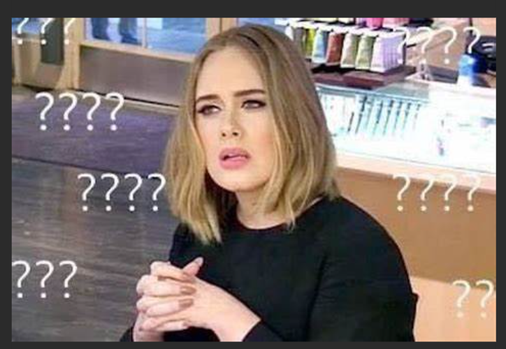

# RDS Snapshot Event Recorder

This project provides an automated, infrastructure-as-code solution to capture, process, and record Amazon Relational Database Service RDS snapshot events using AWS Lambda, Amazon EventBridge, and Terraform.

---

## Table of Contents

1. [Overview](#overview)
2. [Architecture](#architecture)
3. [Features](#features)
4. [Prerequisites](#prerequisites)
5. [Project Structure](#project-structure)
6. [Deployment Guide](#deployment-guide)
   - [1. Clone Repository](#1-clone-repository)
   - [2. Initialize and Plan](#3-initialize-and-plan)
   - [3. Apply Changes](#4-apply-changes)
   - [4. Verify Deployment](#5-verify-deployment)
7. [Terraform Resources](#terraform-resources)
8. [Logging and Storage](#logging-and-storage)
9. [Clean Up](#clean-up)
10. [Troubleshooting](#troubleshooting)
11. [Contributing](#contributing)
12. [Future Advancement](#Future Advancement)

---

## Overview

Alright, let's get into the project! If you are beginner in the cloud you are probably looking for a solution or just out of sheer curosity. Otherwise, if a seasoned cloud expert, you might be wondering, well why isn't she just using AWS Backup???!!!! Afterall, AWS Backup provides an automated report creation for backup and restore so why do we need this?




To help you understand why I decided to go with this approach, let's rewind the movie:

**Main Actress:**
- RDS Databases (NB: we have several other databases in production but the auditors are only concerned with databases that hold our financial statement hence; deposit, withdrawal and reconcillation databases)

**Co-Actors:**
- Auditor A and B
- Engineers

**Producer and Director:**
- Me obviously!

So this is the case scenario. It's the start of the financial year and Auditors A and B as part of the yearly audits, they need EVIDENCE that in the last financial year, our three major financial database; deposit, withdrawals and reconcillation (NB: these were the only names I could imagine for these databases) have been backed up continuously and automatically.

Here is the plot twist!
We presented them with our AWS Backup report and honestly, till this date I still think back and realise this approach was almost a perfect solution but to my dismay and shock, with all those column data AWS includes in the report (such as "Resource ARN", "IAM role", "Expected Completion Time" etc), they didn't add a column for the actual database name. 

You can argue that the database name is embedded in the Amazon Resource Name (ARN), obviously you know that and I know that too but we know this because we are in the cloud computing field, the auditors are not in the cloud computing field. Also, remember all the auditors care about is that our databases "have been backed up continuously and automatically" everyday. So we have a couple of options here:

**1. Change from automated snapshots to manual snapshots.**
This surface level works in theory because automated snapshots are retained for 1 - 35 days, whilst manual snapshots can be retained longer (remember our use case for every single day in the previous year?!) 

Although, this works in theory, it is not an ideal solution because of two main reasons:
- Imagine you had more than 3 databases and you had to take time off your schedule as engineer (possibly troubleshooting errors or creating amazing solutions) to manually take this snapshots, I don't think you will be too pleased, personally I won't be and there is always the human nature of forgetfullness when you are overwhelmed with current task.

- Secondly, the snapshot actually takes a full capture of your data and transactional logs for future purposes but remember, the auditors just want proof that these backups were ongoing not an entire 365 1/4 days of data snapshots which isn't exactly cost effective.

**2. Creating an automated RDS Snapshot Event system recorded into a csv file.**
Based on the evidence, facts and figures I have presented before the cloud court (has a nice ring actually!), I decided to create a system that automatically listens for the RDS Snapshot event for our three databases and records only the needed details in a csv file.

This solution:

- Listens for RDS snapshot creations and deletions via EventBridge.
- Triggers a Lambda function to process and record event details.
- Stores raw event payloads in Lambda CloudWatch Logs 
- Extracts required data and appends daily into a CSV file.
- Is deployed entirely through Terraform for repeatable infrastructure management.


## Architecture Blueprint

```plaintext
┌──────────────┐    RDS Snapshot    ┌────────────────┐
│  Amazon RDS  │ ─────────────────> │ Amazon Event   │
│ (Snapshots)  │                    │ Bridge Rule    │
└──────────────┘                    └────────┬───────┘
                                                │
                                                │ Event matches `RDS DB Snapshot Event`
                                                ▼
                                          ┌───────────────┐
                                          │ AWS Lambda    │
                                          │ (Processor)   │
                                          └────────┬──────┘
                                                   │
                                                   │ Processes event and writes to:
                                                   │ - CloudWatch Logs (optional but useful for troubleshooting)
                                                   ▼
                                        ┌────────────────────┐
                                        │ Storage / Logging   │
                                        │ (S3  │
                                        │ CloudWatch Logs)    │
                                        └────────────────────┘
```

## Architecture Diagram


## Features

- **Event Subscription**: Listens to RDS DB snapshot events (`creation`, `deletion`).
- **Serverless Processing**: Uses a lightweight Lambda for event handling.
- **Configurable Destinations**: Supports CloudWatch Logs, S3 for persistence in our use case.
- **Infrastructure as Code**: Entire setup managed via Terraform.
- **Extensible**: Easily add custom processing, notifications, or filters.

## Prerequisites

- [AWS Account](https://docs.aws.amazon.com/accounts/latest/reference/manage-acct-creating.html) 
- [Terraform](https://www.terraform.io/downloads.html) 

## Project Structure

```
rds-snapshot-event-recorder/
├── .terraform/                   # Terraform working directory
├── layer/                        # Lambda layers or additional code dependencies
├── .gitignore                    # Git ignore rules
├── .terraform.lock.hcl           # Terraform dependency lock file
├── data.tf                       # Data sources configuration
├── event-bridge.tf               # EventBridge rule definitions
├── iam_role.tf                   # IAM roles and policies
├── lambda_function.py            # Lambda handler code
├── main.tf                       # Terraform root configuration
├── provider.tf                   # Terraform provider setup
├── RDS-Snapshot-Tracker.drawio   # Architecture diagram
├── README.md                     # Project documentation
└── variables.tf                  # Input variable definitions
```

## Deployment Guide

### 1. Clone Repository

```bash
git https://github.com/tayelma/RDS_Snapshot_Events_Tracker.git
cd rds-snapshot-event-recorder

NB: I would not advise you clone this repository if you are new in the business and your goal is to learn. You assimilate knowledge better by getting your hands dirty, cloning the repository doesn't get your hands so dirty since you are not building from scratch.
```

### 2. Initialize and Plan

```bash
terraform init
terraform plan -var-file=terraform.tfvars
```

### 3. Apply Changes

```bash
terraform apply -var-file=terraform.tfvars
```

### 4. Verify Deployment

1. In the AWS Console, navigate to EventBridge -> Rules. Confirm your rule is enabled.
2. Go to Lambda -> Functions. Verify your function is deployed with the correct handler.
3. Trigger a manual RDS snapshot creation via Console or CLI:
   ```bash
   aws rds create-db-snapshot --db-snapshot-identifier test-snapshot --db-instance-identifier your-db
   ```
4. Check the CloudWatch Logs attached to your lambda function under the **"Monitor"** tab for the recorded event. [https://docs.aws.amazon.com/lambda/latest/dg/monitoring-cloudwatchlogs-view.html]


## Terraform Resources

- **data**: The "aws_caller_identity" block retrieves the aws profile to be used for the project and the "archive_file" block zips the lambda function in the current directory. The "aws_s3_bucket" data block assumes there is already an existing s3 bucket in your account named "rdssnapshottracker". The challenge for newbies is if you don't have such an s3 bucket you don't need this block in your data.tf and you need to rather create it with a terraform resource block.

- **event-bridge**: Creates an RDS EventBridge rule to listen to RDS events such as snapshots and maps it to your lambda function as the target.

- **iam**: Configures the necessary permissions that allows Lambda to read/write the CSV in S3, describe RDS snapshots, and write logs. NB: you can observe that the describe snapshot permission is scoped down to only the 3 databases we need for our use case.

- **lambda_function**: The python code extracts the RDS Eventbridge event and appends the data in their respective columns **"SourceDatabase", "Snapshot Name", "Status", "Snapshot Creation Time"**  into s3 in this path **"{current_year}/{csv_filename}"**

- **main**: This terraform file creates the lambda function and the cloudwatch log group.

- **provider**: The provider file allows you to set configurations for the aws profile and region, where your terraform state will be stored (in this case, an s3 bucket) and optionally the terraform and aws version you want to use.

## Logging and Storage

- **CloudWatch Logs**: Lambda logging of rds events frome eventbridge for debugging. 

- **Amazon S3**: Persist RDS snapshot event data into a csv files in yearly folders.


## Clean Up to Save Cost

Remove all infrastructure:

```bash
terraform destroy -var-file=terraform.tfvars
```

## Troubleshooting

| Issue                                   | Solution                                                 |
| --------------------------------------- | -------------------------------------------------------- |
| Lambda permission denied                | Ensure EventBridge rule has permission to invoke Lambda. |
| No events in S3                         | Check CloudWatch Logs for errors in Lambda execution.    |
| Terraform plan shows unexpected changes | Verify variable values and versions.              |


## Contributing

1. Fork the repository
2. Create a feature branch (`git checkout -b feature/xyz`)
3. Commit your changes (`git commit -m 'Add new feature'`)
4. Push to your branch (`git push origin feature/xyz`)
5. Open a Pull Request

## Future Advancement

- **Notification**: Extend Lambda to publish to SNS or push to Slack/ Microsoft Teams.


